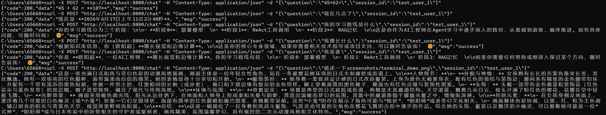

# 🧠 Multimodal AI Agent
Multimodal AI Agent with Vision & RAG · Local Deployment · Full-Stack Intelligence

[](https://github.com/ruanalgebra/agent_project/actions/workflows/ci.yml)


**A local AI agent that integrates visual understanding, knowledge retrieval, tool calling, and multi-turn conversation capabilities.**


---


## 🖥️ Hardware Requirements

- **Recommended**: NVIDIA GPU with ≥ 8GB VRAM (RTX 3060 / 4060 / 5060 or higher)
- **Tested Environment**: RTX 5060 Ti (16GB) + 32GB RAM
- **Model**: Qwen3-VL-8B-Instruct (Q4_K_M quantized)
- **VRAM Usage**: ~4.8-5.5 GB (including context cache)
- **Minimum**: 6GB VRAM (with context length restrictions)
- **4GB VRAM**: Cannot run 8B models; consider Qwen3-VL-2B or API-based alternatives


---


## ✨ Core Capabilities

| Capability | Description |
|:---|:---|
| 👁️ Visual Understanding | Powered by Qwen3-VL multimodal model; generates 300+ word detailed image descriptions |
| 📚 RAG (Retrieval-Augmented Generation) | Chroma vector database + local documents for enhanced retrieval and generation |
| 🛠️ Tool Calling (ReAct) | Custom tools for time queries, math calculations, image description, and spatial understanding |
| 💬 Multi-turn Conversation Memory | LangChain-based message memory for context-aware and identity-aware conversations |


---


## 📊 Resource Consumption Reference

Based on actual testing (RTX 5060 Ti 16GB):

| Scenario | VRAM Delta (MiB) | Total Time (s) | prompt_tokens | completion_tokens |
|:---------|-----------------:|---------------:|--------------:|------------------:|
| Time Query | ~0 | 5.646 | 2597 | 27 |
| Image Description | ~0 | 4.604 | 2640 | 308 |
| RAG Retrieval | ~0 | 1.453 | 2960 | 89 |

> **Note**: VRAM delta refers to the additional consumption of the request itself relative to the "model loaded" state. Model loading itself occupies ~8.5GB VRAM, completed on the first request. Subsequent requests have ~0 MiB VRAM delta. Total time is affected by Prompt Cache hit rate; consecutive requests are faster.


---


## 📦 Tech Stack

| Component | Purpose |
|:---|:---|
| **LangChain (Agent Framework)** | Tool binding, ReAct loop, and multi-turn conversation management |
| **FastAPI + Uvicorn** | HTTP service encapsulation and async interface |
| **Ollama** | Local LLM serving (CPU/GPU) |
| **Qwen3-VL (8B Q4)** | Multimodal vision-language model (image understanding) |
| **Chroma** | Lightweight vector database (RAG retrieval) |
| **nomic-embed-text** | Text embedding model |
| **Docker + Docker Compose** | Containerized deployment and environment management |
| **GitHub Actions** | CI automated testing |
| **Python 3.10+** | Development language |


---


## 📁 Project Structure

    agent_project/
    ├── .github/
    │ └── workflows/
    │ └── ci.yml # GitHub Actions CI config
    ├── app.py # FastAPI main service
    ├── space_understand.py      # Camera capture + spatial understanding
    ├── space_server.py          # Standalone spatial service (host machine)
    ├── config.py # Configuration (env var support)
    ├── test_app.py # pytest test cases
    ├── first_agent.py # Terminal-based Agent (original)）
    ├── agent_with_memory.py # Short-term memory program
    ├── build_vector_store.py # Knowledge base builder
    ├── requirements.txt # Dependencies
    ├── Dockerfile # Docker Docker build file
    ├── docker-compose.yaml # Docker Compose one-click deploy
    ├── .env.example # Environment variable template
    ├── .gitignore # Git ignore rules
    ├── .dockerignore # Docker build ignore rules
    ├── chroma_db/ # Chroma vector database directory
    ├── screenshots/ # Screenshots / test images
    │ ├── terminal_demo.png
    │ ├── terminal_demo_v2.png
    │ ├── terminal_demo_v3.png
    │ └── terminal_demo_v4.png
    └── README.md # Documentation
        

---


## 🚀 Quick Start

### Option 1: Local Run

#### 1. Environment Setup
```bash
# Clone the project
git clone <your-repo-url>
cd agent_project

# Create virtual environment (recommended)
python -m venv venv
source venv/bin/activate      # Linux/Mac
# or
venv\Scripts\activate         # Windows

# Install dependencies
pip install -r requirements.txt
```

#### 2. Start Ollama Service
```bash
# Start Ollama (ensure it's installed)
ollama serve

# Pull required models (if not already downloaded)
ollama pull qwen3-vl:8b-instruct-q4_K_M   # Multimodal vision model
ollama pull nomic-embed-text               # Embedding model
```

#### 3. Prepare Knowledge Base (Optional)

Place your text documents (.txt / .md) in any directory, then run:

```bash
python build_vector_store.py
```
This script reads text files from the specified directory, generates embeddings, and stores them in chroma_db/. Skip this step if you don't need RAG functionality.


#### 4. Start HTTP Service

```bash
    python app.py
```
Service runs at http://localhost:8000

#### 5. Call API
Post /chat —— Send a conversation request
```bash
    curl -X POST "http://localhost:8000/chat" \
         -H "Content-Type: application/json" \
         -d '{"question":"What time is it now","session_id":"demo"}'
```
Response example：
{"code":200,"data":"June 20, 2026 10:54 AM","msg":"success"}

GET /health — Enhanced health check
```bash
    curl http://localhost:8000/health
    ```json
        {
          "status": "ok",
          "ollama": {"reachable": true, "model_loaded": true},
          "chromadb": {"available": true}
        }
        #status: "ok" means all systems normal, "degraded" means a dependency is unavailable
        #ollama.reachable: Whether Ollama service is reachable
        #ollama.model_loaded: Whether the specified model is loaded
        #chromadb.available: Whether the Chroma vector database directory exists
    ```
```

### Option 2: Docker One-Click Deploy (Recommended)

#### 1. Clone Project

```bash
    git clone <your-repo-url>
    cd agent_project
```

#### 2. Configure Environment Variables

Copy .env.example to .env and modify OLLAMA_BASE_URL to your host IP:
```bash
    cp .env.example .env
```
```properties
    # .env
    OLLAMA_MODEL=qwen3-vl:8b-instruct-q4_K_M
    EMBEDDING_MODEL=nomic-embed-text
    OLLAMA_BASE_URL=http://192.168.x.x:11434   # Replace with your host IP
    PORT=8000
    HOST=0.0.0.0

    # Environment & logging config
    ENV=development          # development / production
    LOG_LEVEL=DEBUG          # DEBUG / INFO / WARNING / ERROR
```

#### 3. Start Service

ReBuild Images
```bash
    docker-compose build --no-cache
```
Docker start
```bash
    docker-compose up -d
```
View logs：
```bash
    docker-compose logs
```
Stop service:
```bash
    docker-compose down
```

#### 4. Test
```bash
    curl -X POST "http://localhost:8000/chat" -H "Content-Type: application/json" -d "{\"question\":\"What time is it now\",\"session_id\":\"test\"}"
```

#### 5. Call APII
Post /chat —— Send a conversation request
```bash
    curl -X POST "http://localhost:8000/chat" \
         -H "Content-Type: application/json" \
         -d '{"question":"What time is it now","session_id":"demo"}'
```
Response example：
{"code":200,"data":"June 20, 2026 10:54 AM","msg":"success"}

GET /health — Enhanced health check
```bash
    curl http://localhost:8000/health
```


---


## 🧪 Testing
### Local Testing
```bash
    # Install pytest (if not already installed)）
    pip install pytest

    # Run all tests
    pytest test_app.py -v
```
### CI Automated Testing
This project is configured with GitHub Actions CI. Every push to the main branch automatically runs smoke tests:
https://github.com/ruanalgebra/agent_project/actions/workflows/ci.yml/badge.svg


---


## 📸 Demo

::: screenshot-placeholder
**🖼️ API Test Screenshot**\
(Place `terminal_demo_v4.png` in the `screenshots/` directory; it will be displayed here automatically.)\
[Replace with actual image in the final document]{style="font-size:0.85rem; color:#94a3b8;"}

:::

**Test Cases:**

| User Input | Agent Outpu | Capability Verified |
|:---------|:-----------|:---------|
| `What time is it now` | *June 20, 2026 10:54 AM* | ✅ Tool Calling (Time) |
| `45+62=？` | *107* | ✅ Tool Calling (Math) |
| `Describe screenshots/terminal_demo.png` | *300+ word detailed description (person, clothing, background, style)* | ✅ Multimodal Visual Understanding |
| `I am Ouyang Chao` | *Specializes in vision and edge computing* | ✅ RAG Retrieval |
| `What is my learning path` | *Three-stage learning path* | ✅ RAG Enhanced Retrieval |
| `Who am I` | *You are Ouyang Chao, an AI engineer...* | ✅ Multi-turn Memory |


---


## ⚠️ Testing Notes

### Image Description Testing

On Windows systems, using curl directly in the command line to send JSON containing Chinese characters and paths may cause parsing issues.

**Recommended approach**：Save the request body as payload.json and send via curl:

```bash
# 1. Create payload.json
echo {"question":"Describe screenshots/terminal_demo.png","session_id":"test"} > payload.json

# 2. Send request
curl -X POST "http://localhost:8000/chat" -H "Content-Type: application/json" -d @payload.json
```
### Space Server

For spatial understanding (look_around), you must run space_server.py on the host machine before starting the agent.


---


## ❓ FAQ
### 1. Docker Container Restarts Repeatedly
Check container logs:
```bash
    docker logs agent-api --tail 50
```
Common causes: syntax errors in app.py or missing dependencies. Fix and rebuild:
```bash
    docker-compose up --build -d
```

### 2. Container Cannot Access Host Ollama
Ensure Ollama listens on 0.0.0.0:
```bash
    set OLLAMA_HOST=0.0.0.0
    ollama serve
```
And set OLLAMA_BASE_URL to your host IP in .env.

### 3. Image Description Returns "File Not Found"
·Verify screenshots/ directory is mounted correctly (Docker Compose mounts it by default)
·Verify the image file exists in that directory
·Use the payload.json method described above

### 4. How to Switch Models?
Modify OLLAMA_MODEL in .env, then restart:
```bash
    docker-compose down
    docker-compose up -d
```
Ensure the new model is downloaded in Ollama:
```bash
    ollama pull <new_model_name>
```

### 5. Port Already in Use
Modify the PORT variable in .env, or change the port mapping in docker-compose.yaml:
```yaml
    ports:
    - "8001:8000"   # Change host port to 8001
```

### 6. CI Tests Failing
Check GitHub Actions logs to identify whether the failure is due to missing dependencies or syntax errors. Run pytest test_app.py -v locally to reproduce most issues.


---


## 📌 Roadmap

- ✅ Base Agent Framework (Tool Calling + RAG + Multimodal Vision)
- ✅ Time format optimization (24h → 12h)
- ✅ Relative path support + exception handling for images
- ✅ FastAPI HTTP service encapsulation
- ✅ Multi-session memory (session_id isolation)
- ✅ Configuration separation (config.py)
- ✅ Docker containerization (docker-compose)
- ✅ Structured logging (Loguru) replacing print
- ✅ Enhanced health check (dependency status detection)
- ✅ Multi-environment support (ENV / LOG_LEVEL)
- ✅ CI/CD pipeline (GitHub Actions smoke tests)
- ✅ Spatial understanding (look_around tool with camera)
- ⏳ Production-grade session storage (Redis replacing in-memory dict)
- ⏳ Async interface support (solve large image inference blocking)
- ⏳ End-to-end integration tests
- ⏳ Robotics + Embodied AI exploration

## 📄 License
    MIT © 2026 Chenxi Ruan

## 🤝 Contributing & Feedback
    Issues and Pull Requests are welcome!

------------------------------------------------------------------------


